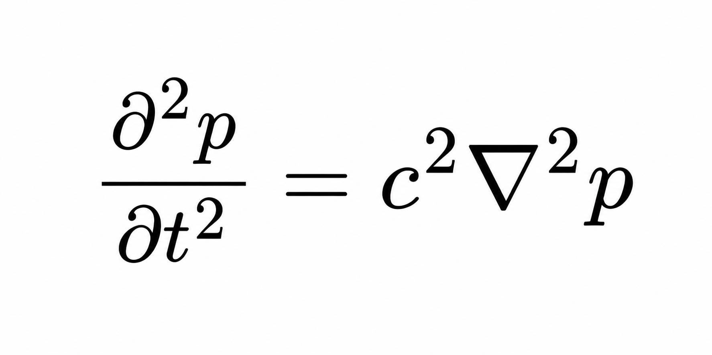

# GPU Accelerated 3D FDTD WaveSolver

High-performance 3D FDTD solver for the linear acoustic wave equation with GPU (CuPy) and CPU (NumPy) performance benchmarking across different grid sizes.

---

## Overview

This repository implements a 3D finite-difference time-domain (FDTD) solver for the linear acoustic wave equation:
<p align="center">
  
</p>
The project is designed for:

* Acoustic wave propagation simulation
* GPU acceleration using CuPy
* CPU/GPU performance benchmarking
* Numerical validation and visualization
* Scientific computing and high-performance computing (HPC) research

The solver supports both CPU (NumPy) and GPU (CuPy) backends, enabling direct performance comparison across different grid resolutions and simulation scales.

---

## Features

* 3D acoustic wave equation solver
* Finite-Difference Time-Domain (FDTD) implementation
* GPU acceleration with CuPy
* CPU implementation with NumPy
* GPU vs CPU benchmarking
* Ricker wavelet source generation
* Gaussian source generation
* Neumann (rigid) boundary conditions
* Receiver signal recording
* Pressure field visualization
* Speedup analysis across different grid sizes

---

## Numerical Model

The solver uses a seven-point Cartesian stencil for the 3D Laplacian operator.

The numerical update scheme follows:
<p align="center">
  
</p>
where
<p align="center">
  
</p>
The Courant stability condition is:
<p align="center">
  
</p>
---

## Repository Structure

```text
.
├── fdtd_solver.py                # Main solver implementation
├── gpu_cpu_comparison.npz        # Benchmark results
├── speedup_results.npz           # Speedup analysis results
├── fdtd_comparison.png           # GPU vs CPU comparison figure
├── speedup_analysis.png          # Speedup visualization
├── README.md
└── requirements.txt
```

---

## Installation

### Clone Repository

```bash
git clone https://github.com/Morrrrilock/GPU-Accelerated-3D-FDTD-WaveSolver.git
cd GPU-Accelerated-3D-FDTD-WaveSolver
```

### Install Dependencies

```bash
pip install -r requirements.txt
```

---

## Requirements

Main dependencies:

```text
numpy
matplotlib
cupy-cuda12x
torch
```

Install manually if needed:

```bash
pip install numpy matplotlib torch
pip install cupy-cuda12x
```

---

## Usage

Run the main benchmark test:

```bash
python FDTD Solver for 3D Linear Wave Equation.py
```

The script will:

1. Run CPU simulation
2. Run GPU simulation
3. Compare performance
4. Validate numerical consistency
5. Generate visualization figures

---

## Example Output

The benchmark produces:

* Receiver signal comparisons
* Pressure field visualization
* GPU vs CPU runtime comparison
* Speedup analysis across different grid sizes

Example metrics:

* GPU speedup factor
* Average simulation steps per second
* Numerical consistency validation
* Pressure field error analysis

---

## GPU Acceleration

GPU acceleration is implemented using CuPy.

If CuPy is unavailable, the solver automatically falls back to CPU mode using NumPy.

Supported environments:

* NVIDIA CUDA GPUs
* Jupyter Notebook
* Windows

---

## Benchmarking

The project includes automated benchmarking for:

* Small grids
* Medium grids
* Large grids

The framework measures:

* Total runtime
* Simulation throughput
* GPU acceleration speedup
* Numerical consistency between CPU and GPU solutions

---

## Visualization

The repository automatically generates:

* Receiver signal plots
* Pressure field slices
* GPU vs CPU comparison figures
* Speedup analysis charts

---

## Applications

Potential applications include:

* Room acoustics
* Wave propagation modeling
* Computational acoustics research
* Numerical PDE simulations
* GPU computing research
* Scientific machine learning workflows
* Hybrid FDTD–machine learning methods

---

## License

This project is released under the MIT License.

---

## Author

Developed by Zongwen(Alex) Hu for for research in:

* Computational acoustics
* Scientific computing
* GPU acceleration
* Wave propagation simulation
* High-performance computing (HPC)

---
